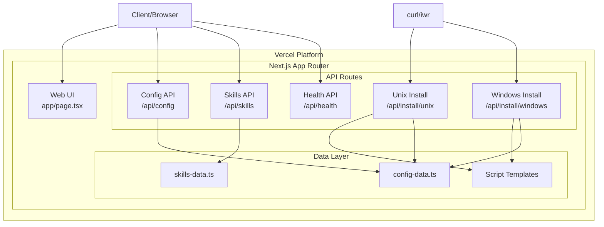
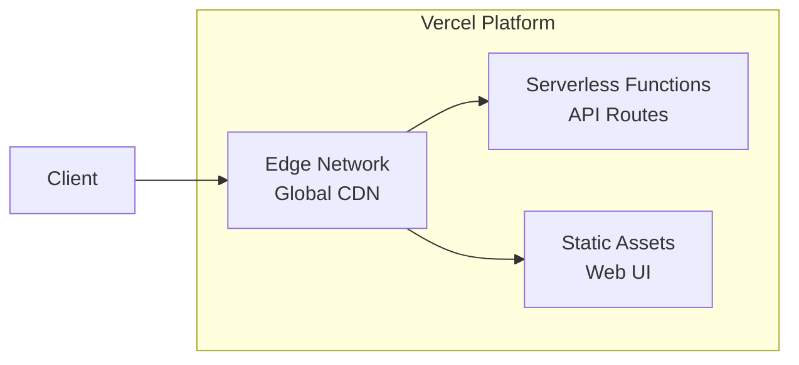

# Design Document: CRUSH 统一配置部署服务

## Overview

本设计文档描述了 CRUSH 统一配置部署服务的技术架构和实现方案。该服务基于 Next.js 16 App Router 构建，部署于 Vercel 平台，为团队成员提供统一的 Crush 配置模板、Skills 管理和跨平台安装脚本。

### 设计目标

1. **简洁性**: 使用 Next.js App Router 的 Route Handlers 实现轻量级 API
2. **可维护性**: 配置数据与 API 逻辑分离，便于更新和扩展
3. **跨平台**: 支持 Unix (Linux/macOS) 和 Windows 平台的安装脚本
4. **可靠性**: 完善的错误处理和健康检查机制

## Architecture



### 技术选型决策

| 决策     | 选择                  | 理由                                       |
| -------- | --------------------- | ------------------------------------------ |
| 框架     | Next.js 16 App Router | 现代化、支持 Edge Runtime、Vercel 原生支持 |
| 部署     | Vercel                | 零配置部署、自动 HTTPS、全球 CDN           |
| 数据存储 | 静态 TypeScript 文件  | 简单、版本控制、无需数据库                 |
| 脚本模板 | 模板字符串            | 灵活、易于维护、支持变量替换               |

## Components and Interfaces

### 1. Config API 模块

**职责**: 返回 Crush 配置模板

**接口定义**:

```typescript
// GET /api/config
interface ConfigResponse {
  version: string; // 语义化版本号 (X.Y.Z)
  updated_at: string; // ISO 8601 时间戳
  schema: string; // Schema URL
  options: ConfigOptions;
  skills: SkillsConfig;
  providers: ProviderConfig[];
}

interface ConfigOptions {
  skills_paths: string[];
  lsp: LSPConfig;
}

interface SkillsConfig {
  enabled: boolean;
  auto_discover: boolean;
}

interface ProviderConfig {
  name: string;
  api_key_env: string;
  models: ModelConfig[];
}
```

**实现路径**: `app/api/config/route.ts`

### 2. Skills API 模块

**职责**: 返回可用 Skills 列表，支持分类过滤

**接口定义**:

```typescript
// GET /api/skills?category={category}
interface SkillsResponse {
  total: number;
  skills: Skill[];
}

interface Skill {
  name: string; // kebab-case 格式
  description: string; // 非空字符串
  enabled: boolean;
  category: SkillCategory;
}

type SkillCategory = "creative" | "design" | "docs" | "dev";
```

**实现路径**: `app/api/skills/route.ts`

### 3. Health API 模块

**职责**: 返回服务健康状态

**接口定义**:

```typescript
// GET /api/health
interface HealthResponse {
  status: "ok" | "error";
  timestamp: string; // ISO 8601 时间戳
  version: string;
}
```

**实现路径**: `app/api/health/route.ts`

### 4. Install Script Generator 模块

**职责**: 生成跨平台安装脚本

**Unix 脚本功能** (`/api/install/unix`):

- 检查 Crush 是否已安装
- 创建配置目录 `~/.config/crush/`
- 下载配置文件
- 克隆/更新 Skills 仓库
- 验证安装结果
- 彩色输出和安装摘要

**Windows 脚本功能** (`/api/install/windows`):

- 检查 Crush 是否已安装
- 创建配置目录 `%LOCALAPPDATA%\crush\`
- 下载配置文件
- 克隆/更新 Skills 仓库
- 验证安装结果
- 彩色输出和安装摘要

**实现路径**:

- `app/api/install/unix/route.ts`
- `app/api/install/windows/route.ts`

### 5. Web UI 模块

**职责**: 提供可视化的配置管理和安装指引

**功能**:

- 显示安装命令（Unix 和 Windows）
- 展示 Skills 列表
- 展示服务特性
- 响应式设计，支持移动端
- 深色主题

**实现路径**: `app/page.tsx`

## Data Models

### 配置数据结构

```typescript
// lib/data/config-data.ts
export interface CrushConfig {
  version: string;
  updated_at: string;
  schema: string;
  options: {
    skills_paths: string[];
    lsp: {
      enabled: boolean;
      servers: Record<string, LSPServerConfig>;
    };
  };
  skills: {
    enabled: boolean;
    auto_discover: boolean;
  };
  providers: Array<{
    name: string;
    api_key_env: string;
    models: Array<{
      name: string;
      display_name: string;
      default?: boolean;
    }>;
  }>;
}

// 配置生成函数
export function generateConfig(): CrushConfig {
  return {
    version: "1.0.0",
    updated_at: new Date().toISOString(),
    schema: "https://charm.land/crush.json",
    // ... 其他配置
  };
}
```

### Skills 数据结构

```typescript
// lib/data/skills-data.ts
export interface Skill {
  name: string; // kebab-case, 唯一标识
  description: string; // 非空
  enabled: boolean;
  category: "creative" | "design" | "docs" | "dev";
}

export const SKILLS: Skill[] = [
  {
    name: "think",
    description: "Extended thinking and reasoning capabilities",
    enabled: true,
    category: "creative",
  },
  // ... 更多 skills
];

// 过滤函数
export function filterSkillsByCategory(
  skills: Skill[],
  category?: string
): Skill[] {
  if (!category) return skills;
  const validCategories = ["creative", "design", "docs", "dev"];
  if (!validCategories.includes(category)) return [];
  return skills.filter((s) => s.category === category);
}
```

### 脚本模板结构

```typescript
// lib/templates/unix-script.ts
export function generateUnixScript(baseUrl: string): string {
  return `#!/bin/bash
# CRUSH Configuration Installer for Unix
# Generated by ${baseUrl}

BASE_URL="${baseUrl}"

# Color definitions
RED='\\033[0;31m'
GREEN='\\033[0;32m'
BLUE='\\033[0;34m'
YELLOW='\\033[1;33m'
NC='\\033[0m'

# ... 脚本内容
`;
}

// lib/templates/windows-script.ts
export function generateWindowsScript(baseUrl: string): string {
  return `# CRUSH Configuration Installer for Windows
# Generated by ${baseUrl}

$BASE_URL = "${baseUrl}"

# Color functions
function Write-Success { ... }
function Write-Error { ... }
function Write-Info { ... }
function Write-Warning { ... }

# ... 脚本内容
`;
}
```

## 目录结构

```
crush-config-server/
├── app/
│   ├── page.tsx                    # Web UI 首页
│   ├── layout.tsx                  # 根布局
│   ├── globals.css                 # 全局样式
│   └── api/
│       ├── config/
│       │   └── route.ts            # Config API
│       ├── skills/
│       │   └── route.ts            # Skills API
│       ├── health/
│       │   └── route.ts            # Health API
│       └── install/
│           ├── unix/
│           │   └── route.ts        # Unix 安装脚本
│           └── windows/
│               └── route.ts        # Windows 安装脚本
├── lib/
│   ├── data/
│   │   ├── config-data.ts          # 配置数据
│   │   └── skills-data.ts          # Skills 数据
│   ├── templates/
│   │   ├── unix-script.ts          # Unix 脚本模板
│   │   └── windows-script.ts       # Windows 脚本模板
│   └── utils/
│       ├── validation.ts           # 数据验证工具
│       └── errors.ts               # 错误处理工具
├── package.json
├── tsconfig.json
├── next.config.js
└── tailwind.config.js
```

## Correctness Properties

_A property is a characteristic or behavior that should hold true across all valid executions of a system—essentially, a formal statement about what the system should do. Properties serve as the bridge between human-readable specifications and machine-verifiable correctness guarantees._

### Property 1: Config API 响应结构完整性

_For any_ Config API 请求，返回的 JSON 响应必须包含 version、updated_at、schema、options、skills 和 providers 字段，且 Content-Type 为 application/json。

**Validates: Requirements 1.1, 1.4, 7.1, 7.4**

### Property 2: JSON 序列化往返一致性

_For any_ 有效的配置对象，序列化为 JSON 后再解析回对象，应该产生等价的配置对象。

**Validates: Requirements 7.2**

### Property 3: Skills API 响应结构与过滤

_For any_ Skills API 请求，返回的响应必须包含 total 和 skills 数组字段。当提供 category 参数时，返回的所有 skills 必须属于该 category。

**Validates: Requirements 2.1, 2.2, 2.3**

### Property 4: Skill 数据验证

_For any_ Skills API 返回的 skill，其 name 必须是唯一的、符合 kebab-case 格式，description 必须是非空字符串。

**Validates: Requirements 8.3, 8.4, 8.5**

### Property 5: Health API 响应结构

_For any_ Health API 请求，返回的响应必须包含 status、timestamp 和 version 字段，其中 timestamp 必须是有效的 ISO 8601 格式，version 必须符合语义化版本格式。

**Validates: Requirements 3.1, 3.3, 3.4**

### Property 6: 安装脚本内容完整性

_For any_ 安装脚本请求（Unix 或 Windows），生成的脚本必须包含：Crush 安装检查、配置目录创建、配置下载、Skills 仓库克隆/更新、安装验证逻辑，且 BASE_URL 必须被替换为实际服务器 URL。

**Validates: Requirements 4.2, 4.3, 4.4, 4.5, 4.6, 4.7, 4.8, 5.2, 5.3, 5.4, 5.5, 5.6, 5.7, 5.8**

### Property 7: 安装脚本输出格式

_For any_ 生成的安装脚本，必须包含彩色输出定义（绿色成功、红色错误、蓝色信息、黄色警告）、安装摘要部分、文档 URL 和下一步操作说明。

**Validates: Requirements 10.1, 10.2, 10.3, 10.4, 10.5**

### Property 8: 错误响应结构

_For any_ API 错误响应，必须返回适当的 HTTP 状态码（4xx 客户端错误，5xx 服务器错误），且响应体必须包含 error 和 message 字段。

**Validates: Requirements 9.1, 9.2**

## Error Handling

### API 错误处理策略

```typescript
// lib/utils/errors.ts
export class ApiError extends Error {
  constructor(
    public statusCode: number,
    public error: string,
    message: string
  ) {
    super(message);
  }
}

export function createErrorResponse(
  statusCode: number,
  error: string,
  message: string
): Response {
  return Response.json({ error, message }, { status: statusCode });
}

// 错误类型映射
export const ErrorTypes = {
  NOT_FOUND: { status: 404, error: "Not Found" },
  METHOD_NOT_ALLOWED: { status: 405, error: "Method Not Allowed" },
  INTERNAL_ERROR: { status: 500, error: "Internal Server Error" },
  VALIDATION_ERROR: { status: 400, error: "Validation Error" },
} as const;
```

### 各 API 错误处理

| API         | 错误场景     | 状态码 | 处理方式             |
| ----------- | ------------ | ------ | -------------------- |
| Config API  | 内部配置错误 | 500    | 返回错误详情         |
| Skills API  | 无效分类参数 | 200    | 返回空数组           |
| Health API  | 服务异常     | 500    | 返回 status: "error" |
| Install API | 脚本生成失败 | 500    | 返回错误信息         |
| 所有 API    | 方法不支持   | 405    | 返回支持的方法       |
| 所有 API    | 资源不存在   | 404    | 返回资源未找到       |

### 安装脚本错误处理

Unix 脚本:

```bash
# 错误处理函数
error() {
    echo -e "${RED}Error: $1${NC}" >&2
    exit 1
}

# 使用示例
command -v crush >/dev/null 2>&1 || error "Crush is not installed..."
```

Windows 脚本:

```powershell
# 错误处理函数
function Exit-WithError {
    param([string]$Message)
    Write-Host "Error: $Message" -ForegroundColor Red
    exit 1
}

# 使用示例
if (-not (Get-Command crush -ErrorAction SilentlyContinue)) {
    Exit-WithError "Crush is not installed..."
}
```

## Testing Strategy

### 测试框架选择

- **单元测试**: Jest + @testing-library/react
- **属性测试**: fast-check
- **API 测试**: Jest + supertest 或 Next.js 内置测试工具
- **E2E 测试**: Playwright (可选)

### 测试类型分布

#### 单元测试

针对具体示例和边界情况：

1. **Config Data 测试**

   - 验证配置生成函数返回正确结构
   - 验证时间戳格式
   - 验证版本号格式

2. **Skills Data 测试**

   - 验证分类过滤功能
   - 验证无效分类返回空数组
   - 验证预定义 Skills 数据完整性

3. **Script Template 测试**

   - 验证 URL 替换功能
   - 验证脚本包含必要的检查逻辑

4. **Error Handling 测试**
   - 验证错误响应格式
   - 验证状态码映射

#### 属性测试

针对通用属性，使用 fast-check 进行属性测试：

```typescript
import fc from "fast-check";

// Property 2: JSON 序列化往返一致性
// Feature: crush-config-server, Property 2: JSON serialization round-trip
test("config serialization round-trip", () => {
  fc.assert(
    fc.property(configArbitrary, (config) => {
      const serialized = JSON.stringify(config);
      const deserialized = JSON.parse(serialized);
      expect(deserialized).toEqual(config);
    }),
    { numRuns: 100 }
  );
});

// Property 3: Skills 过滤属性
// Feature: crush-config-server, Property 3: Skills filtering
test("filtered skills match category", () => {
  fc.assert(
    fc.property(
      fc.constantFrom("creative", "design", "docs", "dev"),
      (category) => {
        const filtered = filterSkillsByCategory(SKILLS, category);
        return filtered.every((skill) => skill.category === category);
      }
    ),
    { numRuns: 100 }
  );
});

// Property 4: Skill 数据验证
// Feature: crush-config-server, Property 4: Skill data validation
test("all skills have valid format", () => {
  fc.assert(
    fc.property(fc.constantFrom(...SKILLS), (skill) => {
      const isKebabCase = /^[a-z][a-z0-9]*(-[a-z0-9]+)*$/.test(skill.name);
      const hasDescription = skill.description.length > 0;
      return isKebabCase && hasDescription;
    }),
    { numRuns: 100 }
  );
});
```

### 测试配置

```typescript
// jest.config.js
module.exports = {
  testEnvironment: "node",
  testMatch: ["**/*.test.ts", "**/*.test.tsx"],
  collectCoverageFrom: ["app/**/*.{ts,tsx}", "lib/**/*.ts", "!**/*.d.ts"],
  coverageThreshold: {
    global: {
      branches: 80,
      functions: 80,
      lines: 80,
      statements: 80,
    },
  },
};
```

### 测试目录结构

```
__tests__/
├── unit/
│   ├── config-data.test.ts
│   ├── skills-data.test.ts
│   ├── unix-script.test.ts
│   ├── windows-script.test.ts
│   └── errors.test.ts
├── property/
│   ├── config.property.test.ts
│   ├── skills.property.test.ts
│   └── scripts.property.test.ts
└── api/
    ├── config.api.test.ts
    ├── skills.api.test.ts
    ├── health.api.test.ts
    └── install.api.test.ts
```

### 测试覆盖要求

| 测试类型 | 覆盖目标           | 说明          |
| -------- | ------------------ | ------------- |
| 单元测试 | 边界情况、错误处理 | 具体示例验证  |
| 属性测试 | 核心业务逻辑       | 100+ 次迭代   |
| API 测试 | 所有端点           | 请求/响应验证 |

## Vercel 部署配置

### 部署架构



### 零配置部署

Vercel 自动检测 Next.js 项目并设置最佳默认值：

- **Build Command**: `next build`（自动检测）
- **Output Directory**: `.next`（自动检测）
- **Install Command**: `npm install` / `pnpm install`（自动检测）
- **Framework**: Next.js（自动检测）

**注意**: 对于标准 Next.js 项目，不需要 `vercel.json` 配置文件。Vercel 会自动处理所有配置。

### 可选 vercel.json 配置

仅在需要自定义缓存策略时使用：

```json
{
  "$schema": "https://openapi.vercel.sh/vercel.json",
  "headers": [
    {
      "source": "/api/install/(.*)",
      "headers": [
        {
          "key": "Cache-Control",
          "value": "s-maxage=300, stale-while-revalidate=600"
        }
      ]
    }
  ]
}
```

### 环境变量

在 Vercel Dashboard → Project Settings → Environment Variables 中配置：

| 变量名                 | 说明                                               | 必需 |
| ---------------------- | -------------------------------------------------- | ---- |
| `NEXT_PUBLIC_BASE_URL` | 服务基础 URL（可选，Vercel 自动提供 `VERCEL_URL`） | 否   |

**URL 获取逻辑**:

```typescript
// 优先级：环境变量 > Vercel 自动变量 > 请求头
function getBaseUrl(request: Request): string {
  return (
    process.env.NEXT_PUBLIC_BASE_URL ||
    (process.env.VERCEL_URL ? `https://${process.env.VERCEL_URL}` : null) ||
    `https://${request.headers.get("host")}`
  );
}
```

### 部署方式

#### 方式一：Git 集成部署（推荐）

1. **推送代码到 GitHub**

   ```bash
   git init
   git add .
   git commit -m "Initial commit"
   git remote add origin https://github.com/fromsko/aommand.git
   git push -u origin main
   ```

2. **连接 Vercel**

   - 访问 https://vercel.com
   - 点击 "New Project"
   - 选择 GitHub 仓库
   - Vercel 自动检测 Next.js，点击 "Deploy"

3. **自动部署**
   - 推送到 main 分支 → 自动生产部署
   - Pull Request → 自动预览部署

#### 方式二：CLI 部署

```bash
# 安装 Vercel CLI
npm i -g vercel

# 登录
vercel login

# 部署到预览环境
vercel

# 部署到生产环境
vercel --prod
```

### 自定义域名

1. 进入 Project Dashboard → Settings → Domains
2. 添加域名并配置 DNS
3. Vercel 自动配置 HTTPS 证书（免费）
